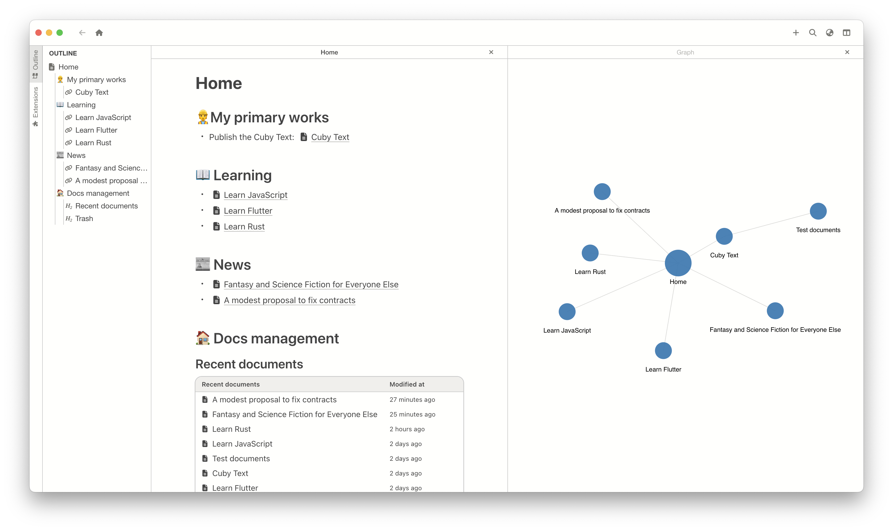
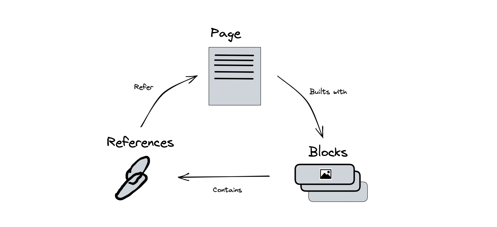
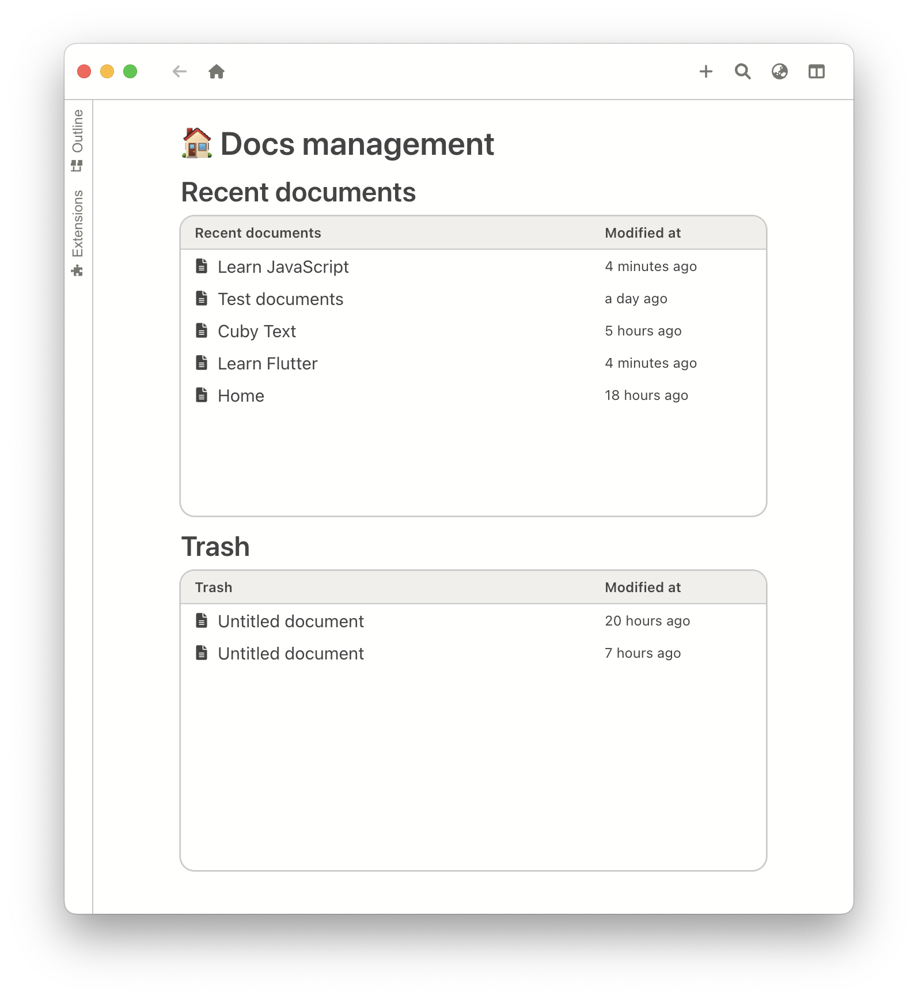
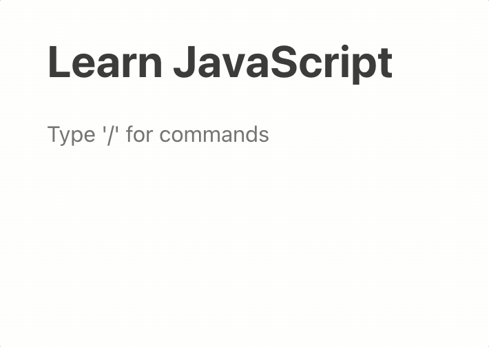
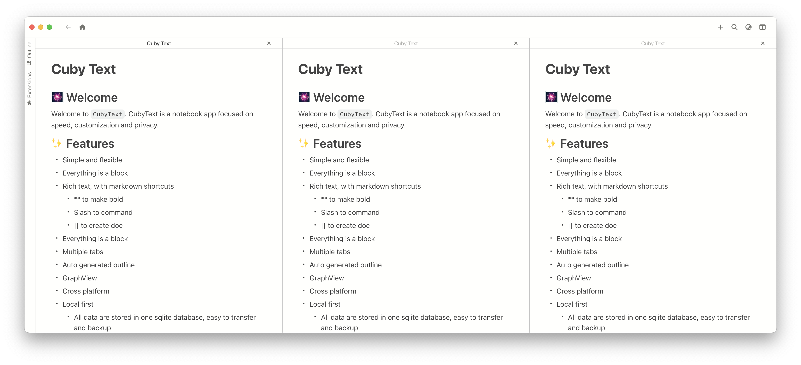
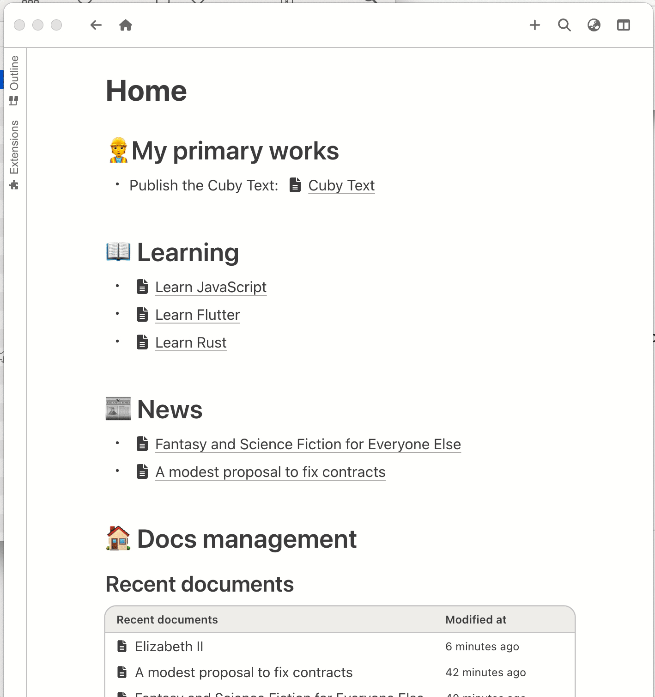
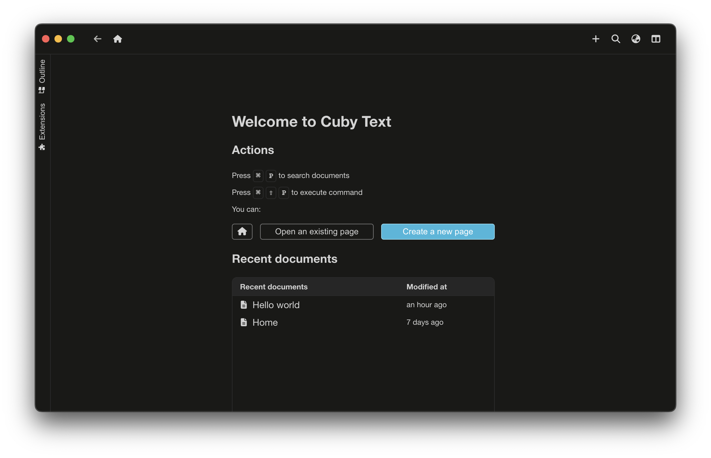

# Cuby Text

## What

Cuby Text is:

- An experimental knowledge management app
- An app focused on writing
- An open source app
- A personal project

Cuby Text is **NOT**:

- An open-source alternative to a commercial product
- A stable product

## Why

Many excellent knowledge management apps are based on extended markdown files.
They are powerful but not expressive.

New products use blocks to organize their content.
It's very inspirational. I like them, but I want privacy and native experiences too.

So I created CubyText. It's fast and designed to be extensible.
To achieve this goal I built the [blocky editor](https://github.com/vincentdchan/blocky-editor).

It doesn't have complex concepts, just simple pages and blocks. No big deal.

## Download

[Releases](https://github.com/vincentdchan/CubyText/releases)

## Features

- Simple and flexible
  
- Everything is a block

  

- Rich-text, with markdown shortcuts
  | Bold | Heading |
  | ---- | ------- |
  |  |  |

  - Press `[[` to create references

    

- Multiple tabs
  
- Auto outline/graph generation
- Cross platforms
  - MacOS
  - Windows
  - Linux
- Local first

  - All data are stored locally in one file, easy to transfer and backup
  - Fast loading and searching

    

- Dark mode
  

Work in progress:

- [ ] Extensions(WIP)

## Technologies

The primary third-party libraries and frameworks:

- **[Blocky editor](https://github.com/vincentdchan/blocky-editor)**
- **[Preact](https://preactjs.com/)**
- **[Force graph](https://github.com/vasturiano/force-graph)**
- **[SQLite](https://www.sqlite.org/index.html)**
- **[Electron](https://www.electronjs.org/)**

The principles:

- The dependencies should be as few as possible
- The tech stack should be easy to learn and contribute

## Contributing

[CONTRIBUTING](./CONTRIBUTING.md)

## FAQ

### How to sync data between devices?

**TLDR:** not support yet

This feature is intended to be implemented by the extension API.
